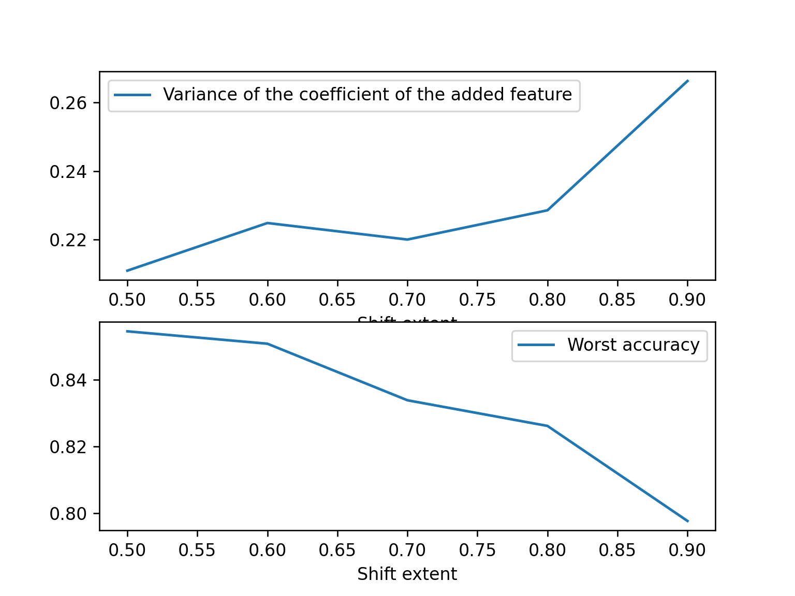
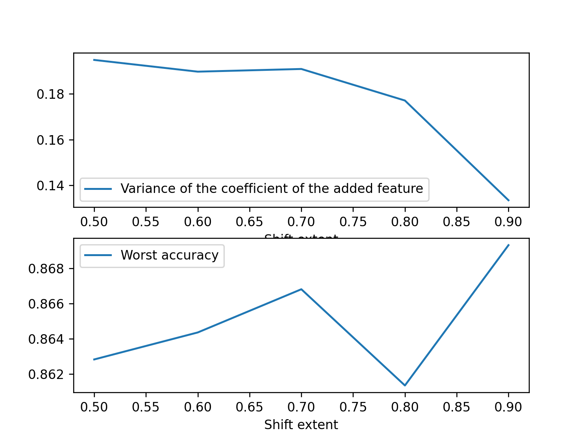
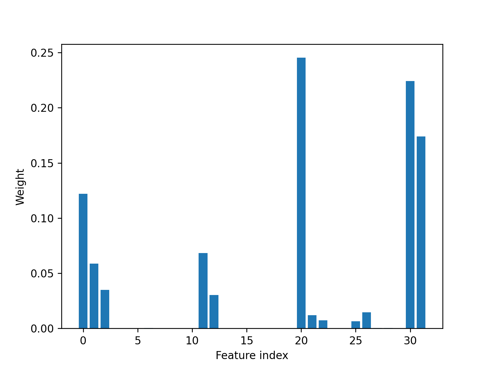
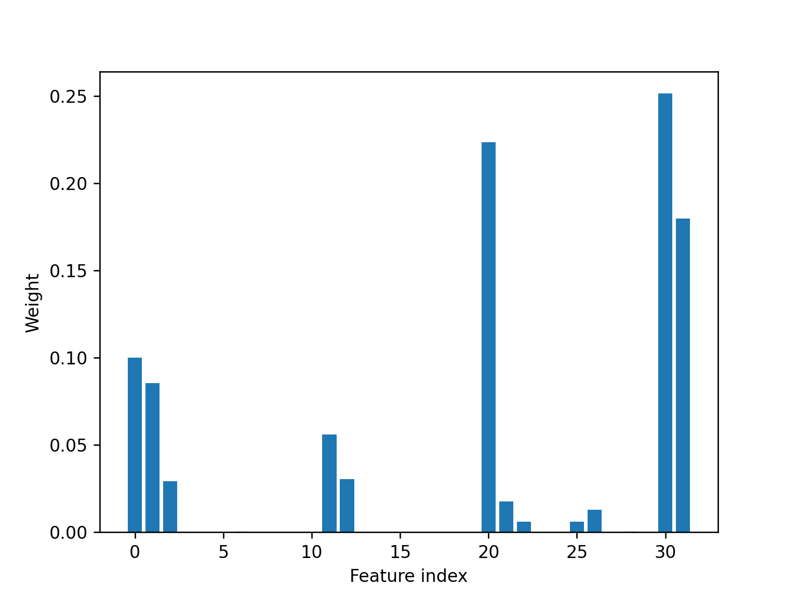
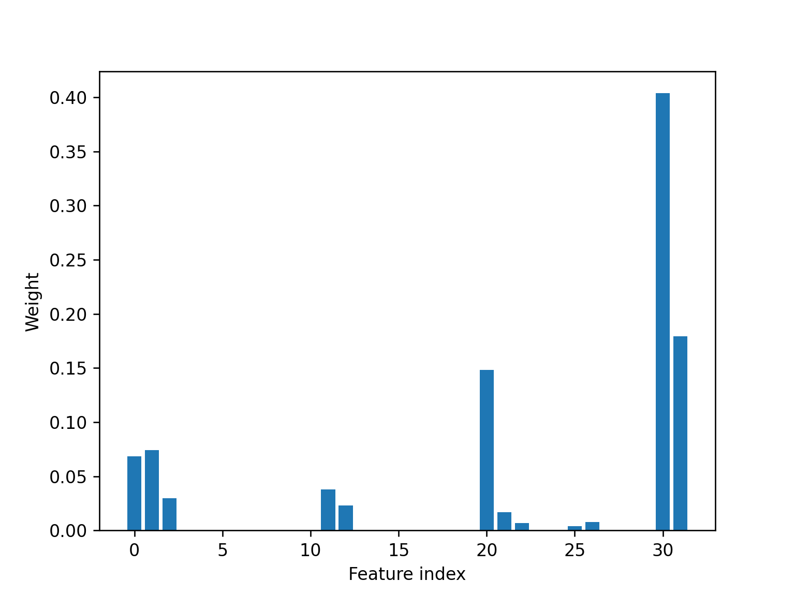
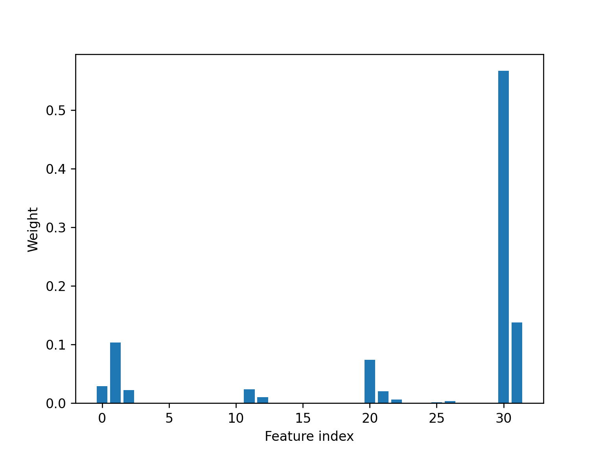
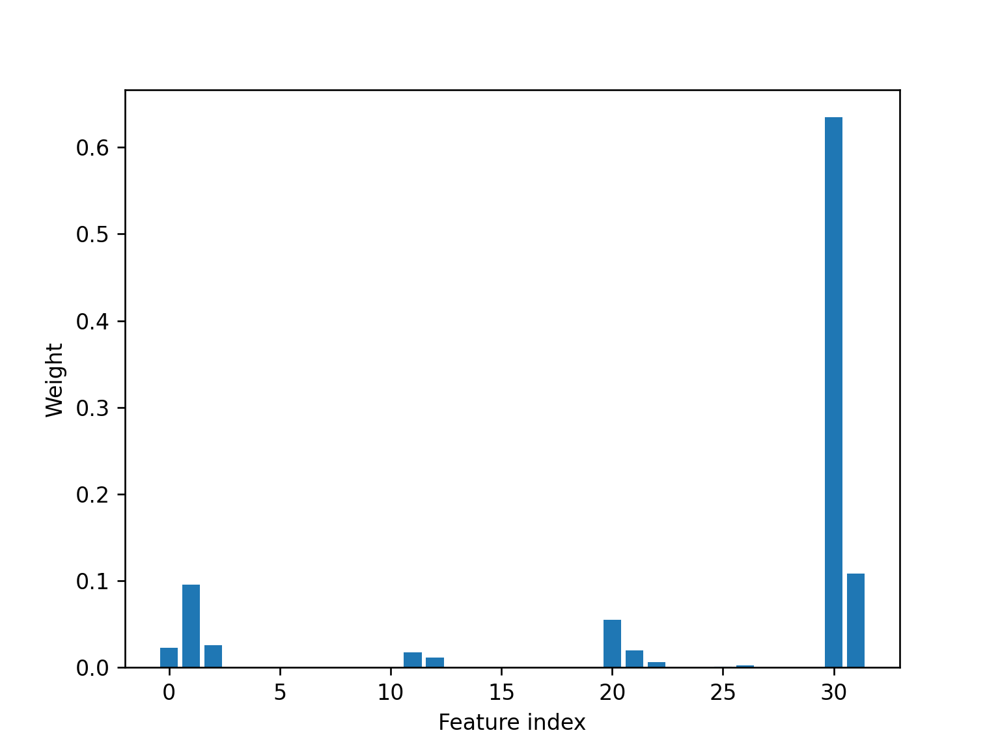
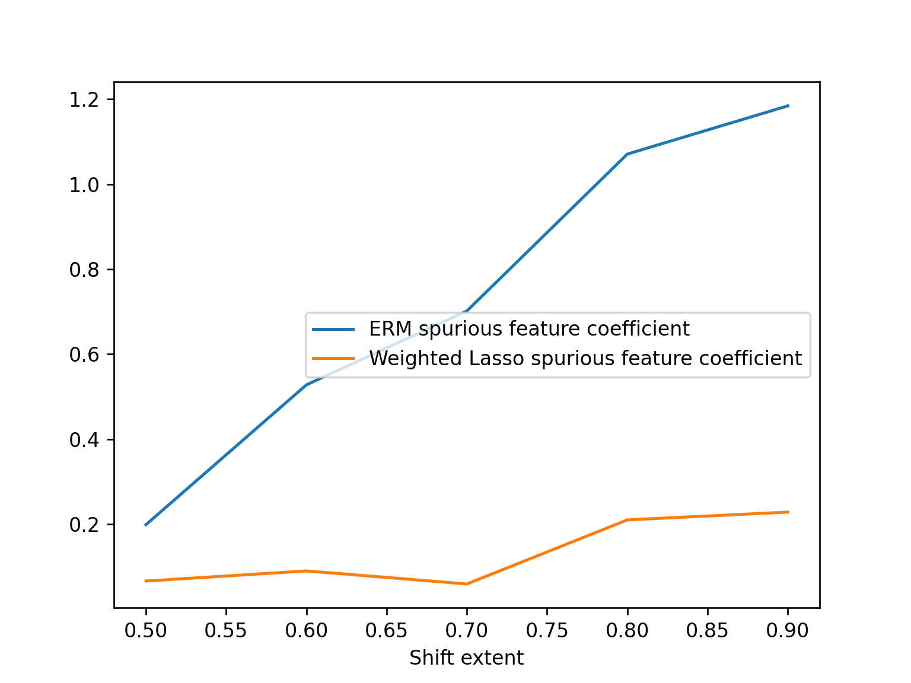
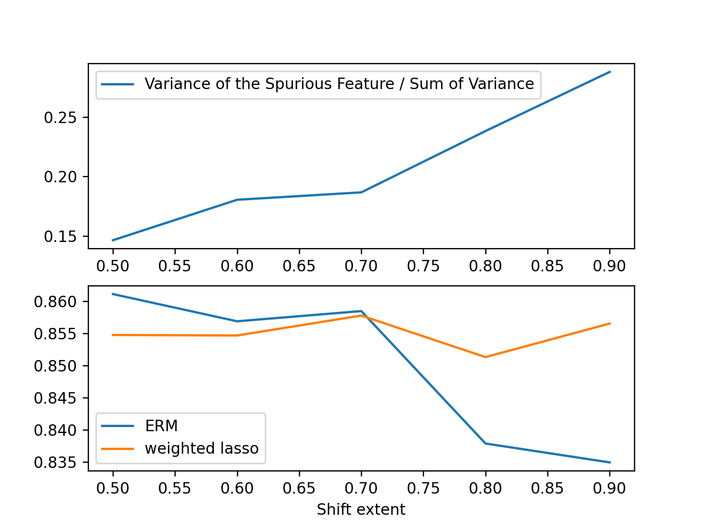

# toy experiemnt
1. breast_cancer dataset from sklearn
2. add an additional "spurious feature"
- proportion of samples for each subgroup

|  a \ y   | 0  |  1  |
|  ----  | ----  | ---- |
| 0  |  c*(x) |  (1-c)*1-x |
| 1  | c*(1-x) | (1-c)*x  |

x controls the degree of Spurious correlation (x = 0.5 means no SC, while x = 1 means perfect SC)

c controls the degree of Class imbalance

### setting
c is about 0.5, all being the same for all experiments.
- train: x ranges from 0.5 - 0.9
- test: x is fix to be 0.5

- 

for each x, repeat 10 times and take the average of wa and var

in each repeat, bootstrap 100 times, train 100 model, get 100 coefficient about the spurious feature, calculate its variance.

## additional experiments

### a. Compared to Attribute imbalance
 
|  a \ y   | 0  |  1  |
|  ----  | ----  | ---- |
| 0  |  c*b |  (1-c)*b |
| 1  | c*(1-b) | (1-c)*(1-b)  |

c still controls Class Imbalance

b controls Attribute Imbalance
- 
  
1. worst group accuracies are almost the same.
2. higher imbalance lead to lower variance (think about the extreme case, b = 1 it will become a pure noise, coefficient should be 0)

### b. Add a noisy feature
the noisy feature is generated the same way as "spurious feature in test set"

- half to be N(0, sigma), another half to bee N(1, sigma)
- the last dim is noisy feature, the 30th feature is spurious feature

#### Weight
These two pictures show the weight
Our method will mainly focus on the spurious feature

- the following are x = 0.5 -> x = 0.9
- 
- 
- 
- 
- 

### conclusion about additional experiments
From these two additional experiments, we can see that the way I add the feature itself won't cause much extra variance (from b section), and the increase of "shift extent" will not directly cause vairance to increase (from a section).

the reason why certain feature has a higher vairance has to be correlated with its spurious information and they are positively related.

## algorithm design
- motivation: avoid the model to make it decision based on features with high variance

### Weighted Lasso
A handwritten Logistic Regression, with l1-regularization and a weight, this weight controls the penalty for different features.

$$ loss = Cross Entrophy + torch.sum(weight * torch.abs(w))$$

### how weight is chosen
after bootstrap 100 times, calculate the variance for each feature.

$$ weight = \frac{(variance^2)}{np.sum(variance^2)}$$

### experiment setting
- Adam optimizer
- added feature: 

                the 30th feature: spurious feature
                the 31th feature: irrelevant feature
- all results are repeated for 10 times and take their average

### results
1. our method can make the model focus less on the spurious feature

2. our method can significantly impove the model's worst group accuracy when SC degree is high

